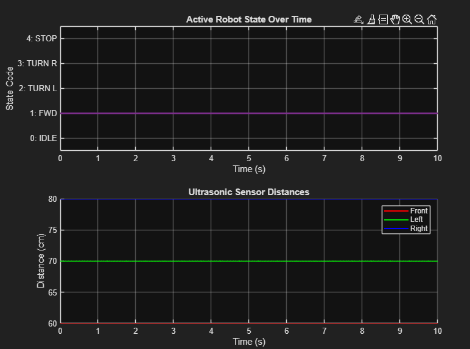

# Guardian Rover: Autonomous Control System

[](https://www.mathworks.com/)
[](https://www.mathworks.com/products/simulink.html)
[](LICENSE)

An advanced autonomous navigation and control architecture engineered for the Guardian Rover using **MATLAB** and **Simulink**.

---

## 📋 Project Objectives

* **Robust Sensor Processing:** Translates raw analog voltages from three ultrasonic sensors (Front, Left, Right) into physical distance metrics and binary collision flags using 1-D Lookup Tables and saturation limits.
* **Noise-Resilient Filtering:** Employs a continuous-execution debounce filter to stabilize raw obstacle flags against transient noise before triggering state changes.
* **Autonomous Decision Matrix:** Evaluates spatial clearance via an Enabled Subsystem and custom MATLAB functions to dynamically dictate rover maneuvers (`IDLE`, `FORWARD`, `TURN_LEFT`, `TURN_RIGHT`, `STOP`).
* **Fail-Safe Emergency Latch:** Features a triggered emergency override protocol to force an immediate system stop under critical conditions.
* **Modular Architecture:** Utilizes structured Bus objects (`EmergencyStateBus`, `SensorDataBus`) for clean signal routing across subsystems.
* **Automated Telemetry & Diagnostics:** Managed entirely by a master initialization script that executes the simulation and outputs synchronized `Timeseries` diagnostic plots.

---

## 🗂️ Repository Structure

```text
├── run_MAIN.m             # Master initialization and execution script
├── Sensor_Process.slx     # Core Simulink control and simulation model
├── DebounceFilter.m       # Filter logic for obstacle stabilization
├── EmergencyState.m       # Programmatic definition for emergency bus objects
├── SensorDataBus.m        # Programmatic definition for sensor data bus objects
├── LICENSE                # MIT License
└── README.md              # Project documentation
```

---

## ⚙️ Prerequisites

* MATLAB R2021b or later *(update to match what you actually developed on)*
* Simulink
* No additional toolboxes required beyond base MATLAB/Simulink *(add Stateflow, Control System Toolbox, etc. here if your model uses them)*

---

## 🚀 How to Run

1. **Clone the repository:**
   ```bash
   git clone https://github.com/M0h7amed/Guardian-Rover-Control.git
   ```
2. Open MATLAB and set your current working directory to this repository folder.
3. Open and run the master script in your Command Window:
   ```matlab
   run_MAIN.m
   ```
4. **What happens automatically:**
   * Loads required Bus object definitions into the base workspace.
   * Configures control gains and thresholds (`dist_threshold_stop`, `dist_threshold_turn`, `debounce_limit`).
   * Executes the simulation model.
   * Automatically generates and displays a dual-panel figure window showing the active robot state transitions and synchronized sensor distance telemetry over time.

---

## 🛠️ System Architecture Highlights

* **Sensor Processing:** Dual-path conversion mapping voltages to calibrated distances and proximity threshold flags.
* **Decision & Routing:** Switch-case dispatchers routing integer commands to specific action subsystems, merged cleanly for diagnostic output and human-readable string translation.
* **Data Logging:** Configured with `Timeseries` logging format for precise time-synchronized workspace extraction.

---

## 📸 Sample Output

The dual-panel figure below is generated automatically by `run_MAIN.m`: active robot state (top) and synchronized ultrasonic sensor distances (bottom) over the simulation window.



---

## 📄 License

This project is licensed under the MIT License — see the [LICENSE](LICENSE) file for details.

---

## 👤 Author

**Mohamed Nabil Ali Abd Elaziz Soliman**
Mechatronics and Robotics Engineering Program, Ain Shams University
